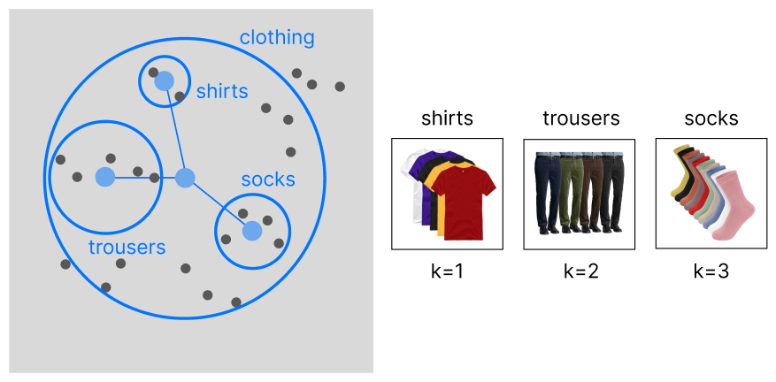
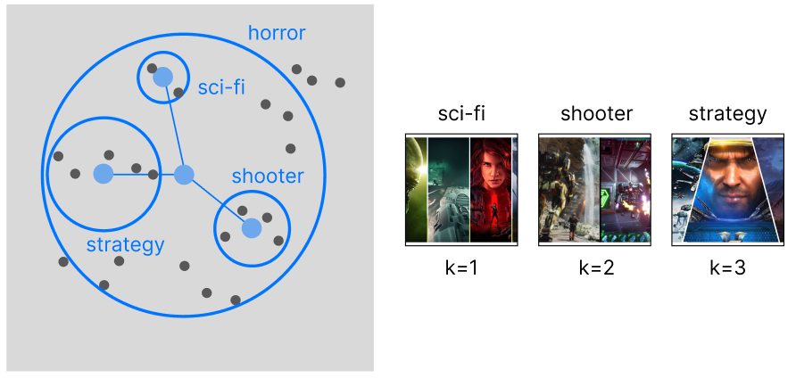

# Please cite
Algorithm: **Univariate Sequential Recommender** 
Author: **Michelangiolo Mazzeschi** 
Published: **30th November 2024**

# Univariate Sequential Recommender

Keeping track of user history on a single vector/array.  
This repository is based on the following technical article (*WIP), and is an implementation of the **item-based** univariate sequential recommender (*see **recommender.ipyn***).

The alternative approach (**category-based**) is not part of the code, yet.

